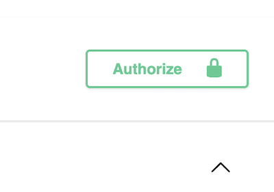

# REST API

Web API for Kardias Project.

FastAPI | SQLAlchemy | PostgreSQL | Pydantic | AWS


## AWS Lambda

Deployment:

https://fxnqc075vd.execute-api.us-east-1.amazonaws.com/dev/docs

Demo Authorization token (tier 1): tempaccess8903



### Container

Build image.

```shell
docker build -t kardias-api . 
```

Test locally.

```shell
docker run -p 9000:8080 kardias-api 
```

Tag.

```shell
docker tag kardias-api:latest ...
```

Upload.

```shell
docker push ...
```

More: https://docs.aws.amazon.com/lambda/latest/dg/images-create.html#images-create-from-base


### Deployment

Using Elastic Container Service to deploy to AWS Lambda. 

Connect via API Gateway (REST API).

Use proxy in API Gateway, etc.


### Notes

https://www.sqlshack.com/calling-an-aws-lambda-function-from-another-lambda-function/

https://fastapi.tiangolo.com/tutorial/background-tasks/


## Endpoints:

- GET /
- POST /api/v1/patient
- ...
- POST GET DELETE UPDATE /api/v1/clean (Tier 2 auth)