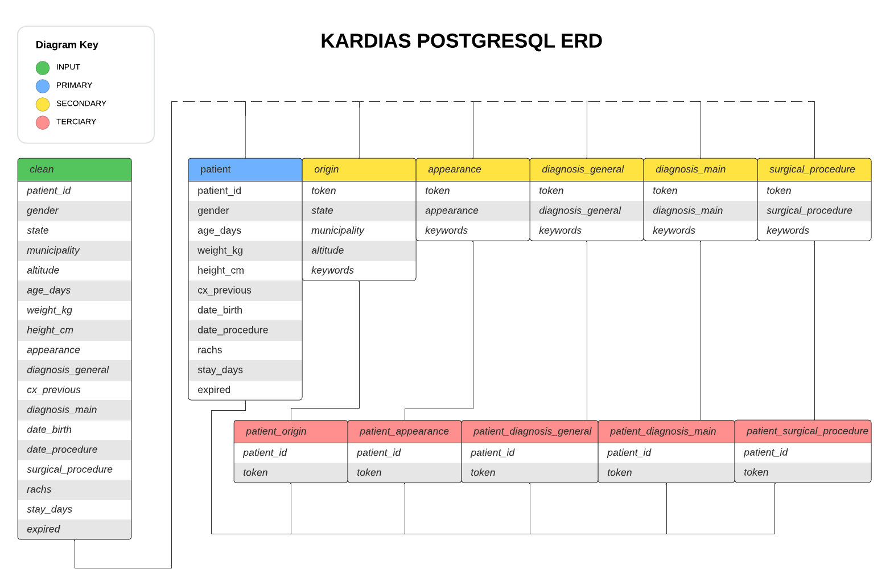

# Database

## Description

The REST API is the only service that is connected to the database so all documentation regarding SQL schemas, ORM Models, database design lives here.

The database aims for at least 3NF normalization as there are a lot of Natural Language elements and categories related to a single Patient's data.

## Entity Relationship Diagram

We store all Medical Terms, Descriptive information, and State data in separate tables from the Patient table, even if the relationship is one to one. Then we store separate tables of Patient id to Medical Term Tokens to represent one to many relationships between a single Patient and multiple Medical Terms, as well as the Origin and Appearance tables which have one to one relationships.

